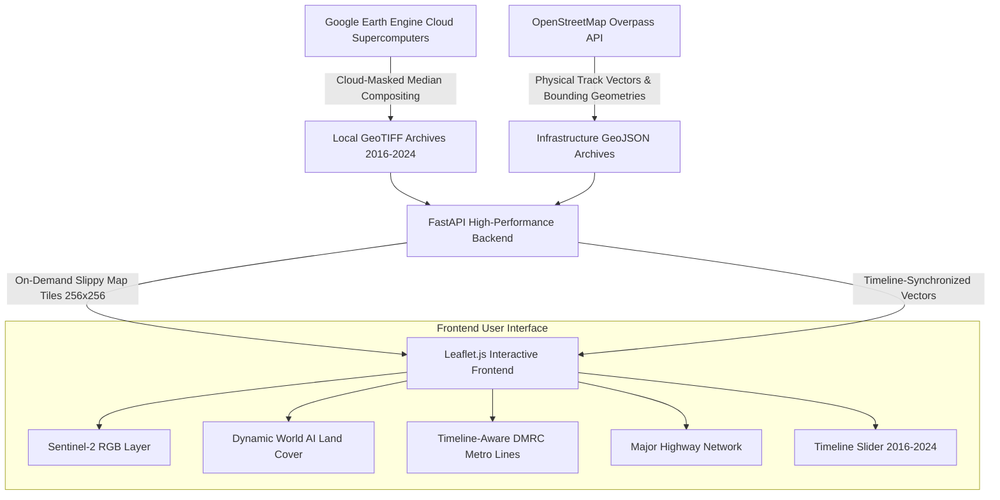

# 🌍 TerraTime — Land Growth Intelligence & Predictive Expansion Platform

> **Capstone Project (CPG No. 238)**  
> **Computer Science & Engineering Department**  
> **Thapar Institute of Engineering and Technology, Patiala, Punjab**  
> *Under the Mentorship of:* **Dr. Nitin Saxena (Assistant Professor - III, CSED)**  

---

### 👥 Team Members:
* **Dhruv Ranjan** (102303780)
* **Arshia Bagchi** (102303770)
* **Achal Nawal** (102303779)
* **Pooja Bisht** (102303845)
* **Sameer Rai** (102303773)

---

## 📌 Executive Summary

**TerraTime** is an AI-powered Earth Observation and Spatiotemporal Intelligence platform designed to analyze, quantify, and predict peri-urban land expansion and transit-oriented development (TOD). 

By ingesting multi-temporal **ESA Sentinel-2** multispectral satellite imagery (10m resolution) and **Google Dynamic World (9-class AI land cover)** from **2016 to 2024**, combined with **OpenStreetMap physical transit networks**, TerraTime models how transport infrastructure (highways and metro corridors) catalyzes urban sprawl.

```
       PAST (2016 – 2024)                    PRESENT                   FUTURE (2025 – 2027)
┌────────────────────────────────┐    ┌────────────────────┐    ┌────────────────────────────────┐
│ Multi-Temporal Earth Data      │    │ Physical Transit   │    │ Machine Learning Forecast      │
│ • Sentinel-2 10m Cloud-Masked  │ +  │ & Highway Network  │ ─► │ • Random Forest Classifier     │
│ • Dynamic World 9-Class Land   │    │ • DMRC Metro Lines │    │ • 500m Grid Growth Velocity    │
│   Use (Built-up, Crops, Water) │    │ • Major Highways   │    │ • Urban Sprawl Probability Map │
└────────────────────────────────┘    └────────────────────┘    └────────────────────────────────┘
```

---

## 🏗️ System Architecture



---

## 📊 Project Completion Status & Roadmap

| Milestone / Phase | Description | Status |
| :--- | :--- | :---: |
| **Phase 1: Earth Observation Ingestion & Tile Engine** | Multi-year Sentinel-2 & Dynamic World GeoTIFF pipelines, cloud masking, FastAPI mathematical tile server (`EPSG:3857`). | **100% DONE ✅** |
| **Phase 2: Timeline-Aware Transit & Highway Network** | Exact curved metro tracks (15,339 GPS points), highway curves (21,181 GPS points), official DMRC styling, timeline synchronization. | **100% DONE ✅** |
| **Phase 3: 500m Grid Growth Velocity Engine** | Divide study area into 500m cells, calculate $\Delta \text{Built-up}$ and cumulative velocity score ($V_i$), generate velocity heatmap. | **UP NEXT ⏳** |
| **Phase 4: Machine Learning Expansion Prediction** | Train Random Forest on $d_{\text{road}}$, $d_{\text{metro}}$, urban density; validate with Cohen's Kappa & F1; predict 2025–2027 expansion. | **UP NEXT ⏳** |
| **Phase 5: RAG "Explain This Area" LLM System** | Clickable grid cells query local spatial stats and feed an LLM to generate plain-English urban growth reports in real-time. | **UP NEXT ⏳** |

---

## 🔍 Precisely What Has Been Completed (In-Depth Technical Details)

### 1. 🛰️ Multi-Temporal Earth Observation Ingestion (Phase 1)
* **Sentinel-2 Multi-Spectral Ingestion (`gee_export.py`, `download_test_geotiff.py`)**:
  * Ingested Level-2A surface reflectance data across Delhi NCR and Mumbai for all 9 years (**2016, 2017, 2018, 2019, 2020, 2021, 2022, 2023, 2024**).
  * Implemented Scene Classification Layer (`SCL`) cloud-masking to eliminate cloud shadows, cirrus, and aerosol artifacts.
  * Computed annual median pixel composites across 70+ satellite passes per year.
* **Google Dynamic World (9-Class AI Land Cover)**:
  * Ingested annual near-real-time 10m land cover classification rasters (`delhi_dw_2016.tif` through `delhi_dw_2024.tif`).
  * Mapped 9 distinct land use categories: *Water (Blue), Trees (Green), Grass (Light Green), Flooded Veg (Cyan), Crops (Yellow), Shrub/Scrub (Tan), Built-up Urban (Red), Bare Ground (Grey), Snow/Ice (White)*.
* **High-Speed Mathematical Slippy Tile Server (`app.py`)**:
  * Custom FastAPI endpoint `/api/tiles/{city}/{dataset}/{year}/{z}/{x}/{y}.png`.
  * Computes Web Mercator Quadtree boundaries ($X, Y, Z \to \text{Lat/Lon Bounds}$) dynamically.
  * Uses `rasterio` windowed reading with bilinear resampling to render $256 \times 256$ PNG tiles in $< 50\text{ms}$ with in-memory caching.

---

### 2. 🚇 Timeline-Aware Transit & Highway Network Engine (Phase 2)
* **Meter-Accurate Physical Track & Highway Geometry (`fetch_exact_infrastructure.py`, `clean_metro_tracks.py`)**:
  * Downloaded physical railway tracks and major expressways from OpenStreetMap Overpass Cloud API.
  * **`delhi_metro_lines.geojson` (1.58 MB)**: Contains **472 main passenger running track segments** with **15,339 exact GPS curve waypoints** (capturing elevated flyover viaducts, Yamuna river bridge crossings, and underground tunnel arcs).
  * **`delhi_metro_stations.geojson` (93 KB)**: **280 station nodes** with verified coordinates.
  * **`delhi_roads.geojson` (2.47 MB)**: **3,069 highway segments** with **21,181 exact GPS curve waypoints** (Dwarka Expressway, Eastern & Western Peripheral Expressways, Delhi-Meerut Expressway, NH-48).
  * Filtered out internal maintenance depots and parking sidings to ensure clean, publication-ready transit cartography.
* **Dual-Stroke Authentic DMRC Color Styling**:
  * Outer white casing stroke ($5.0\text{px}$, 85% opacity) for high contrast over dark satellite imagery.
  * Inner colored track stroke ($3.0\text{px}$) with official DMRC hex color codes:
    * 🟡 **Yellow Line** (`#ffcc00`): *Samaypur Badli ↔ Millennium City Centre Gurugram*
    * 🔵 **Blue Line** (`#0070c0`): *Dwarka Sector 21 ↔ Noida Electronic City / Vaishali*
    * 🔴 **Red Line** (`#e61919`): *Rithala ↔ Shaheed Sthal (Ghaziabad)*
    * 🌺 **Magenta Line** (`#c00060`): *Janakpuri West ↔ Botanical Garden*
    * 🌸 **Pink Line** (`#ff66cc`): *Majlis Park ↔ Shiv Vihar (Ring Road)*
    * 🟣 **Violet Line** (`#7030a0`): *Kashmere Gate ↔ Raja Nahar Singh (Ballabhgarh)*
    * 🟢 **Green Line** (`#00b050`): *Inderlok/Kirti Nagar ↔ Brig. Hoshiar Singh*
    * 🟠 **Airport Express** (`#ff6600`): *New Delhi ↔ IGI Airport ↔ Yashobhoomi Dwarka 25*
    * 🔷 **Aqua Line** (`#00cccc`): *Noida Sector 51 ↔ Greater Noida Depot*
    * 🔵 **Rapid Metro** (`#003399`): *Cyber City Loop ↔ Sector 55-56*
* **Timeline-Synchronized 4-Layer Evolution Engine (`tag_all_infrastructure_years.py`, `index.html`)**:
  * Added historical commissioning years (`opening_year`) to every metro track, station, and highway.
  * Moving the **Timeline Slider (2016 ↔ 2024)** simultaneously updates:
    1. **Satellite imagery** of that exact year.
    2. **Dynamic World AI land cover** of that exact year.
    3. **Operational Metro Lines**: Only lines opened in or before that year appear in their authentic colors (e.g. Pink and Magenta lines dynamically light up in 2018; Aqua Line in 2019; Yashobhoomi extension in 2023).
    4. **Operational Highways**: Expressways appear in the exact year of inauguration (e.g. Peripheral Expressways in 2018, Delhi-Meerut Expressway in 2021, Dwarka Expressway in 2024).

---

### 3. 🎨 Premium Glassmorphic User Interface (`index.html`)
* **Dark Mode Glassmorphism**: Frosted glass sidebars, top bar, dynamic legends, and floating control cards (`backdrop-filter: blur(16px)`).
* **Non-Sticky, High-Contrast Tooltips**: Frosted dark tooltips with bright white titles (`#ffffff`), neon cyan accents, and instant mouseout cleanup to prevent visual clutter.
* **Responsive Multi-City Support**: Seamlessly pan, fly, and switch between Delhi NCR and Mumbai with automatic layer re-fetching.
* **Opacity & Layer Toggles**: Independent toggles and sliders for Sentinel-2, Dynamic World, Metro Networks, Major Highways, and OpenStreetMap Labels.

---

## 🛠️ What Needs To Be Done Next (Upcoming Work)

### 📈 Phase 3: Grid-Cell Spatiotemporal Change Detection & Growth Velocity Engine
1. **$500\text{m} \times 500\text{m}$ Spatial Discretization**:
   * Tessellate Delhi NCR into a regular $500\text{m} \times 500\text{m}$ grid (~12,000 cells).
2. **Built-Up Pixel Transition Quantification**:
   * Intersect each grid cell with Dynamic World rasters from 2016 to 2024.
   * Calculate the percentage of built-up urban land ($B_t$) per cell per year.
3. **Cumulative Growth Velocity Metric ($V_i$)**:
   * Compute velocity score: $V_i = \frac{B_{2024} - B_{2016}}{\Delta t}$ and identify acceleration hotspots (e.g. Dwarka Expressway corridor, Noida Expressway, Greater Noida West).
4. **Velocity Heatmap Layer**:
   * Render a dynamic color-coded choropleth/raster layer in `index.html` (Cool Blue $\to$ Neon Yellow $\to$ Flaming Red).

---

### 🤖 Phase 4: Machine Learning 2025–2027 Expansion Prediction Model
1. **Spatial Feature Engineering**:
   * Calculate distance to nearest highway ($d_{\text{road}}$) via KD-Tree spatial indexing.
   * Calculate distance to nearest metro station ($d_{\text{metro}}$).
   * Calculate 8-neighbor urban built-up density ($N_{\text{built}}$).
   * Include historical growth velocity ($V_i$) from Phase 3.
2. **Supervised Model Training**:
   * Train a `RandomForestClassifier` on 2016 $\to$ 2021 transition data.
   * Target variable: $Y = 1$ if cell transitioned from non-built-up to built-up by 2024, $Y = 0$ otherwise.
3. **Model Validation & Evaluation**:
   * Evaluate against 2024 ground truth: Cohen's Kappa ($\kappa \ge 0.80$), F1-Score, Precision, Recall, and ROC-AUC curve.
4. **Future Expansion Forecasting (2025–2027)**:
   * Run trained model on 2024 state to generate probability of urbanization ($P_{\text{urban}} \in [0, 1]$) for 2025–2027.
   * Export prediction raster and render the **Predictive Expansion Layer** on the map.

---

### 💬 Phase 5: RAG "Explain This Area" LLM Urban Analytics Agent
1. **Interactive Spatial Inspection**:
   * Clicking any grid cell on the map queries its multi-year metrics via `/api/analytics/{cell_id}`.
2. **Retrieval-Augmented Generation (RAG)**:
   * Construct structured prompt with:
     * Built-up growth rate (e.g. $+34\%$ from 2016 to 2024).
     * Proximity to transport (e.g. $420\text{m}$ to Magenta Line station, $650\text{m}$ to Highway).
     * Land use transition breakdown (crops lost vs. buildings gained).
3. **LLM Generation**:
   * Pass prompt to LLM to stream a plain-English diagnosis into the side analytics panel (e.g., *"This cell experienced rapid transit-oriented expansion following the opening of the Magenta Line in 2018..."*).

---

## 📂 Project Repository Structure

```
e:\capstone\
├── app.py                             # FastAPI server & Slippy Map tile renderer
├── index.html                         # Glassmorphic Leaflet.js interactive web app
├── requirements.txt                   # Python dependencies (FastAPI, Rasterio, Numpy, Pillow)
├── README.md                          # Comprehensive Capstone Project Documentation
│
├── data/
│   ├── geotiffs/                      # Multi-year Sentinel-2 & Dynamic World GeoTIFFs
│   │   ├── delhi_s2_2016.tif ... 2024.tif
│   │   ├── delhi_dw_2016.tif ... 2024.tif
│   │   ├── mumbai_s2_2016.tif ... 2024.tif
│   │   └── mumbai_dw_2016.tif ... 2024.tif
│   └── infrastructure/                # Physical vectors with historical opening years
│       ├── delhi_metro_lines.geojson   # 472 curved track segments (15,339 curve points)
│       ├── delhi_metro_stations.geojson# 280 station nodes
│       └── delhi_roads.geojson         # 3,069 highway segments (21,181 curve points)
│
├── gee_export.py                      # Master Google Earth Engine 10m exporter to Drive
├── download_test_geotiff.py           # Direct GEE streaming downloader
├── fetch_exact_infrastructure.py      # Overpass API physical curve downloader
├── clean_metro_tracks.py              # Depot & siding filter for clean passenger tracks
└── tag_all_infrastructure_years.py    # Historical commissioning year tagging engine
```

---

## 🚀 Quickstart & Local Setup

### 1. Prerequisites
* Python 3.10+
* Google Earth Engine account (authenticated via `earthengine authenticate`)

### 2. Installation
```powershell
# Clone the repository
git clone https://github.com/Achalnawal2745/capstone.git
cd capstone

# Create and activate virtual environment
python -m venv venv
.\venv\Scripts\Activate.ps1

# Install required dependencies
pip install -r requirements.txt
```

### 3. Running the Application
```powershell
python app.py
```
Open your browser and navigate to:
```
http://localhost:5000
```

---

## 📜 Academic References & Citations

1. **Dynamic World**: Brown, C.F., Brumby, S.P., et al. (2022). *Large-scale, real-time land cover mapping with Dynamic World.* Nature Scientific Data, 9(1), 251.
2. **Sentinel-2**: Drusch, M., Del Bello, U., et al. (2012). *Sentinel-2: ESA's optical high-resolution mission for GMES operational services.* Remote Sensing of Environment, 120, 25-36.
3. **Random Forest for LULC**: Breiman, L. (2001). *Random Forests.* Machine Learning, 45(1), 5-32.
4. **OpenStreetMap**: Haklay, M., & Weber, P. (2008). *OpenStreetMap: User-Generated Street Maps.* IEEE Pervasive Computing, 7(4), 12-18.
