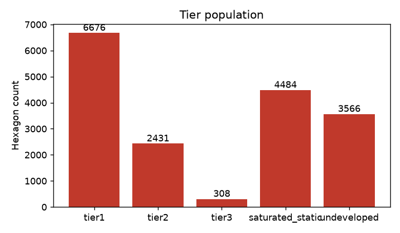
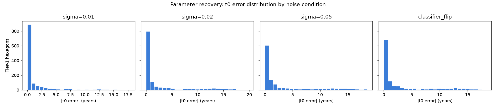
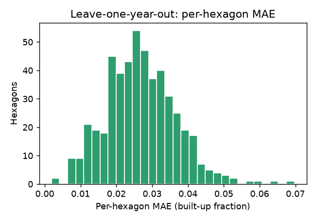
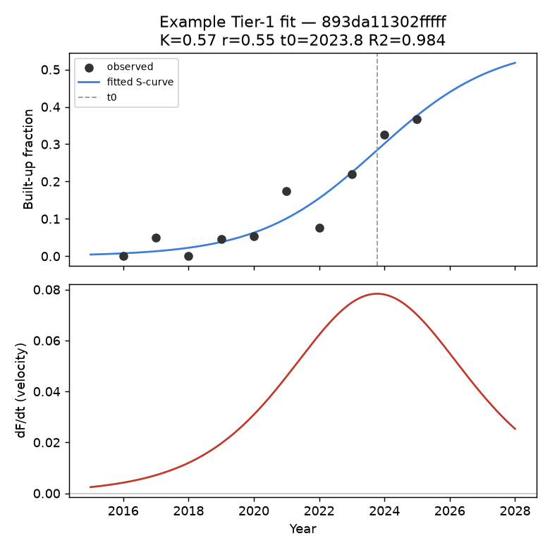

# TerraTime Pillar 1 — Validation Report

**Data provenance: SIMULATED DATA**

## Tier population

| Tier | Count | % |
|---|---|---|
| tier1 | 6676 | 38.2% |
| tier2 | 2431 | 13.9% |
| tier3 | 308 | 1.8% |
| saturated_static | 4484 | 25.7% |
| undeveloped | 3566 | 20.4% |
| **TOTAL** | **17465** | 100.0% |

## Parameter recovery (synthetic ground truth)

| Noise condition | n | Tier-1 fit | True Tier-1 recovered | K MAE | r MAE | t0 MAE (yrs) | t0 median abs err | t0 p90 abs err |
|---|---|---|---|---|---|---|---|---|
| sigma=0.01 | 2000 | 1244 | 79.0% (1493 true) | 0.1194 | 0.1463 | 1.35 | 0.17 | 3.93 |
| sigma=0.02 | 2000 | 1260 | 76.0% (1493 true) | 0.1717 | 0.3151 | 2.57 | 0.30 | 11.23 |
| sigma=0.05 | 2000 | 1173 | 68.5% (1493 true) | 0.2049 | 0.4863 | 3.23 | 0.68 | 12.30 |
| classifier_flip | 2000 | 1234 | 72.8% (1493 true) | 0.1969 | 0.4438 | 3.03 | 0.54 | 11.85 |

**Headline: at realistic noise (sigma=0.02), the engine recovers the inflection year to within +-0.3 years (median), +-11.2 years (90th percentile).**

## Leave-one-year-out validation

Refit 500 Tier-1 hexagons, holding out each observed year in turn (5000 total held-out predictions).

- **MAE (built-up fraction): 0.0269**
- Median absolute error: 0.0180
- 90th percentile absolute error: 0.0649

## Face validity — named Delhi landmarks

**7/7 passed.**

| Location | H3 cell | Expected | Actual | Velocity (frac/yr) | Result | Note |
|---|---|---|---|---|---|---|
| Karol Bagh | `893da116223ffff` | Saturated | Saturated | 0.0000 | PASS |  |
| Lajpat Nagar | `893da115e3bffff` | Saturated | Saturated | 0.0000 | PASS |  |
| Dwarka Sector 21 | `893da11006bffff` | Maturing | Maturing | 0.0380 | PASS |  |
| Rohini Sector 24 | `893da18ea7bffff` | Maturing | Maturing | 0.0301 | PASS |  |
| Narela | `893da184287ffff` | Emerging / Accelerating | Accelerating | 0.1432 | PASS |  |
| Bawana | `893da185653ffff` | Emerging / Accelerating | Accelerating | 0.0571 | PASS |  |
| Yamuna floodplain (Zone O ref) | `893da114cd3ffff` | velocity ~ 0 | velocity=0.0000 | 0.0000 | PASS | OK: no significant growth |

## Example Tier-1 fit

